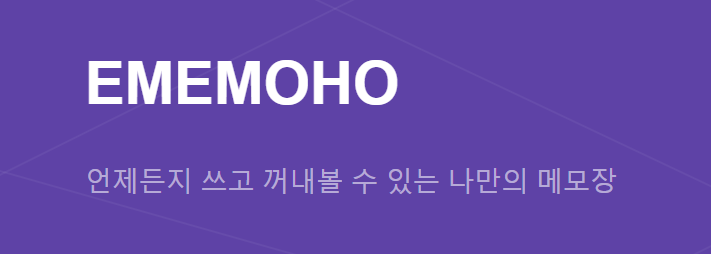
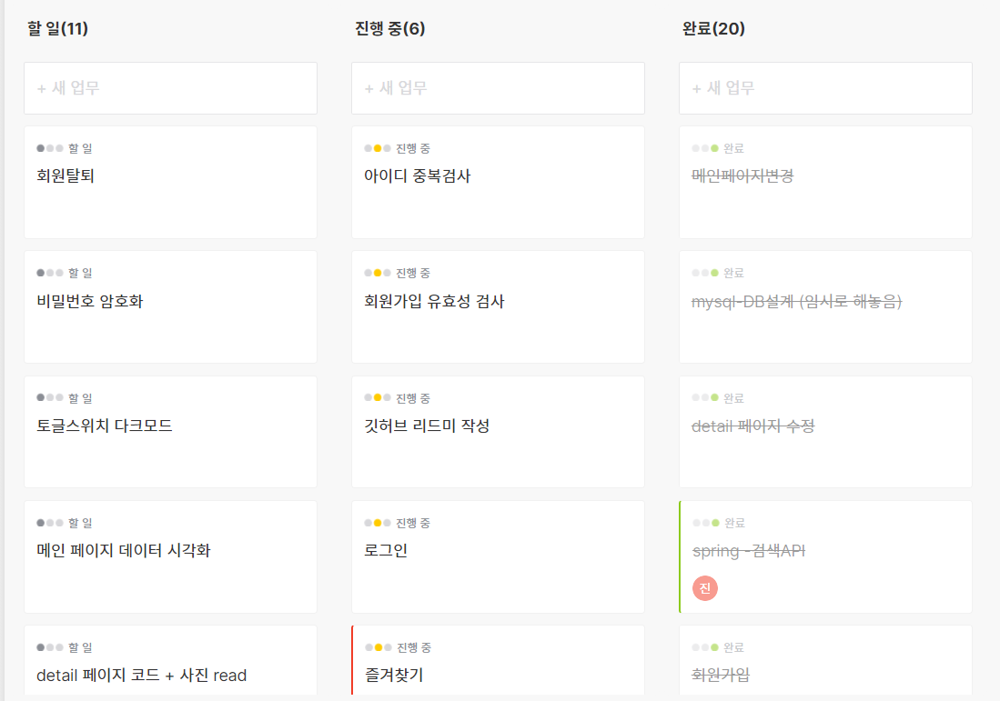
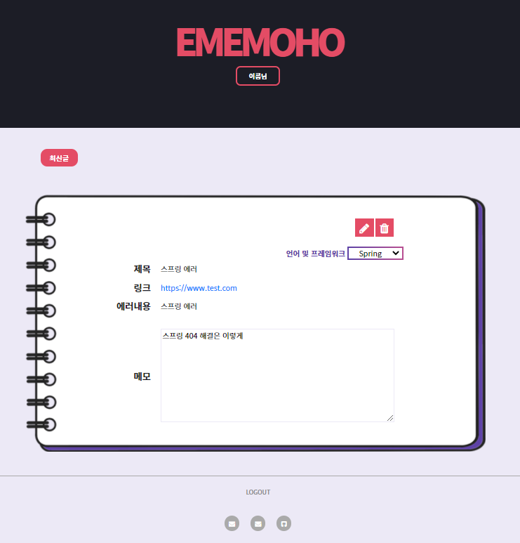
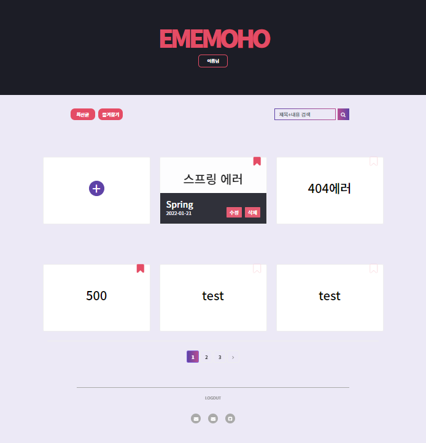
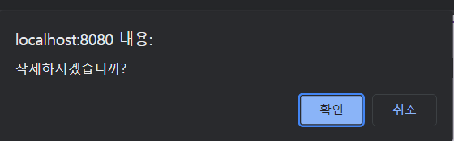
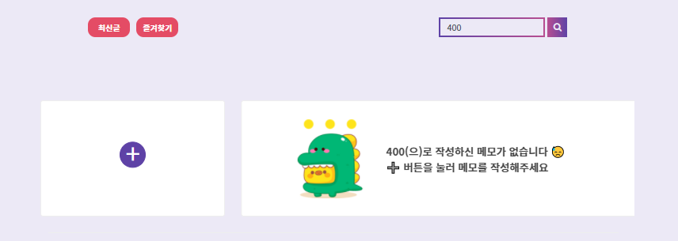
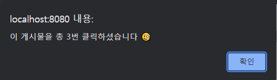

<!-- 
 -->
<!-- 
 -->
<!-- 
 -->

# **📕 EMEMOHO 📕**

 

**개발하면서 만나는 에러들의 해결과정을 링크와 함께 저장하는, 언제든지 꺼내볼 수 있는 나만의 메모장**
<!-- 
 -->

 

 
 

## 💻 프로젝트 이름

- EMEMOHO(에메모호)

 
 

## 👩‍💻 개발 인원

- 총 2명 ([윤빛나라(팀장)](https://github.com/yoonbitnara), [이진솔](https://github.com/losuif))

 
 

## 📅 프로젝트 기간

- 에자일방법론으로 2021.12.20. ~ 2022.1.24. 진행

 
 

## 🔎 개발 환경

- Spring 4.3.18.RELEASE

- JAVA 1.8

- TOMCAT 9.0

- MySQL 8.0.26

- MyBatis 3.4.1

- Maven Eclipse Plugin 2.9 

 
 

## 🌟 기술 스펙

- HTML5

- CSS3 (Bootstrap)

- JavaScript ES6 (jQuery, ajax)

- Java 1.8 (Spring)

- Spring Security

- MySQL

- MyBatis

- Git / Github

 
 

## 🔨 사용툴

- VSCode

- STS3

- Workbench

- Photoshop

- Swit(일정 관리)

    

 
 

## 🗽 구현 기능
 

### 🌝 Front

- 전체 페이지 디자인

- 메인 페이지 구현

- 게시물 목록 뷰 구현

- 게시물 조회 뷰 구현

- 게시물 수정 뷰 구현

 
 

### 🌚 Back

- 회원가입(비밀번호 암호화), 회원탈퇴

    - 비밀번호 암호화

 
 

- 로그인, 로그아웃 

    - 로그인 한 아이디로 작성한 메모만 출력되도록 구현

 
 

- 게시물 등록 API 구현

- 게시물 조회 API 구현

    

 
 

- 게시물 목록 API 구현

    

    - 게시물의 제목 출력
    
    - hover 시 선택한 언어(or 프레임워크)와 작성 날짜 출력

    - 목록 화면에서 게시물 수정 페이지로 이동 가능

    - 목록 화면에서 게시물을 바로 삭제할 수 있도록 구현

 
 

- 게시물 수정 API 구현

- 게시물 삭제 API 구현

    - 게시물 목록 페이지 또는 게시물 조회 페이지에서 삭제 가능
    
    

 
 

- 검색 기능 구현
    
    - 제목 또는 내용으로 검색되도록 구현

    - 검색 후 페이지 이동시에도 검색어 유지되도록 구현

    - 검색 결과가 없는 경우엔 안내 멘트와 게시물 작성 버튼 출력

    

 
 

- 페이징

    - 한 페이지당 6개의 게시물이 출력되도록 구현

    - 단, 첫 번째 페이지에는 등록 버튼과 5개의 게시물 출력

 
 

- 조회수

    - 게시물 클릭 시 DB에서 조회수 증가
    
    - 게시물을 총 몇 번 클릭했는지 알려주는 alert창

    

 
 

## ⚙ 업데이트 예정

- 즐겨찾기

- 언어별 카테고리 추가

- 회원들의 언어별 데이터 시각화

- 소셜로그인